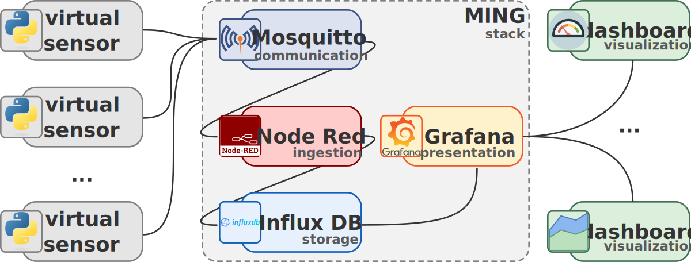

# SII40
Group project for the SII40 course.

This university project focuses on the utilization of the MING stack, comprising [Mosquitto](https://mosquitto.org/), [Influx DB](https://www.influxdata.com/), [Node Red](https://nodered.org/) and [Grafana](https://grafana.com/), in the context of an imaginary manufacturing industry equipped with an IoT sensor network. The project aims to demonstrate how these technologies can effectively enhance the safety of workers.

To achieve this objective, we simulate a network of sensors that publish messages to an MQTT Mosquitto broker. The data collected from these sensors is stored in the InfluxDB time-series database, facilitated by a Node-RED service acting as the data ingestor. Finally, we leverage Grafana to visualize and analyze the collected data, as depicted in the accompanying figure.



Through this study case, we illustrate the potential of the MING stack in providing valuable insights and real-time monitoring, enabling proactive safety measures and empowering decision-makers to ensure a secure working environment for industrial workers.

## Installation and Usage
This project requires [Docker](https://docs.docker.com/) and [Docker Compose](https://docs.docker.com/compose/). After downloading this repository, run:
```bash
docker compose up -d
```
to start all of the necessary services, then:
```bash
docker compose down
```
to shut down.

The following services will be available on `localhost`:
- Mosquitto on port 1886
- [InfluxDB](http://localhost:8086) on port 8086 (user `admin`, password `password`)
- [Node Red](http://localhost:1880) on port 1880
- [Grafana](http://localhost:3000) on port 3000 (user `admin`, password `admin`)

By default, virtual sensors will start automatically to produce data which will be collected into Influx DB.

## Virtual Sensors
[](https://github.com/marco-zanella/SII40/actions/workflows/VirtualSensorsDockerImage.yml)

In this project, we simulate the data collected by sensors using a Python script that publishes messages to an MQTT broker. The configuration of virtual sensors can be easily managed through the dedicated  [sensors.yml](virtual-sensors/sensors.yml) YAML file. We have categorized the sensors into two main groups: `environment` and `person`. The `environment` sensors measure factors such as temperature, humidity, and carbon dioxide levels. On the other hand, the `person` sensors monitor vital signs of individuals, including body temperature and heart rate.

Each message follows a specific format, as shown below:
```JSON
{
    "name": "temperature",
    "value": 25.3,
    "absolute-error": 0.5,
    "timestamp": 1686933196
}
```
Here, the `name` field represents the type of measurement being recorded (e.g., `temperature`, `humidity`, `co2`, `body-pressure`, etc.), the `value` field indicates the numerical value of the measurement (or `null` if unavailable), the `absolute-error` field denotes the declared absolute error of the sensor, and the `timestamp` field represents the UNIX generation timestamp, measured in seconds.

Furthermore, additional information is available within the message topic itself, which follows different structures depending on the sensor type:
* For environmental sensors: `sensors/{room id}/environment/{sensor id}`
* For personal sensors: `sensors/{room id}/person/{person id}/{sensor id}`

In the topic structures mentioned above, the `{room id}` represents the identifier of a specific room, the `{sensor id}` serves as the unique identifier for a sensor, and the `{person id}` is utilized exclusively for personal sensors.

By simulating the sensor data and adopting this structured approach, we aim to create a realistic environment for exploring and analyzing the collected data, enabling effective monitoring and safety enhancement in various scenarios.

## Data Storage
The data obtained from sensors is securely stored in the InfluxDB time series database. To ensure seamless interoperability with other services, we have established a standardized interface for all types of measurements collected.

The common interface for each measurement is defined as follows:
```JSON
{
    "type": "person",
    "room": "room-01",
    "person": "person-01",
    "sensors": "body-temperature-01",
    "name": "body-temperature",
    "value": 36.6,
    "absolute-error": 0.1,
    "timestamp": 1686933196,
    "received": 1686933197
}
```
In the provided interface, the `received` field signifies the UNIX timestamp when the system received the data, which typically aligns with the generation timestamp. The other fields maintain the same description as previously mentioned.

By adopting this standardized interface, we ensure consistent data representation and compatibility across various services. This facilitates efficient data sharing, analysis, and integration with other components of the system, ultimately enhancing the overall functionality and interoperability of the project.